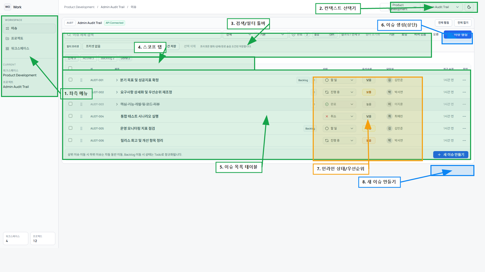

# 홈(첫 화면) 온보딩 주석 가이드

## 1. 번호별 마킹 설명
| 번호 | 기능 | 동작 | 설명 |
|---|---|---|---|
| 1 | 좌측 메뉴 | 조회 | 이슈/프로젝트/워크스페이스 화면으로 이동합니다. |
| 2 | 컨텍스트 선택기 | 조회 | 현재 워크스페이스/프로젝트 컨텍스트를 전환합니다. |
| 3 | 검색/필터 툴바 | 조회 | 제목 검색, 상태/밀도/완료 숨김 필터를 조합합니다. |
| 4 | 스코프 탭 | 조회 | 전체/Active/Backlog/Done 범위를 빠르게 전환합니다. |
| 5 | 이슈 목록 테이블 | 조회 | 현재 컨텍스트의 이슈 목록을 확인합니다. |
| 6 | 이슈 생성(상단) | 생성 | 상단 `+ 이슈 생성` 버튼으로 새 이슈를 등록합니다. |
| 7 | 인라인 상태/우선순위 | 수정 | 목록 행에서 상태/우선순위를 바로 변경합니다. |
| 8 | 새 이슈 만들기 | 생성 | 하단 `+ 새 이슈 만들기`로 빠르게 추가합니다. |

## 2. 첫 진입 온보딩 순서
1. `1` 좌측 메뉴에서 이슈 화면으로 진입합니다.
2. `2` 컨텍스트 선택기로 대상 워크스페이스/프로젝트를 맞춥니다.
3. `3`, `4`에서 필요한 조회 범위를 좁힙니다.
4. `6` 또는 `8`에서 첫 이슈를 생성합니다.
5. 생성 후 `7`에서 상태/우선순위를 바로 업데이트합니다.
