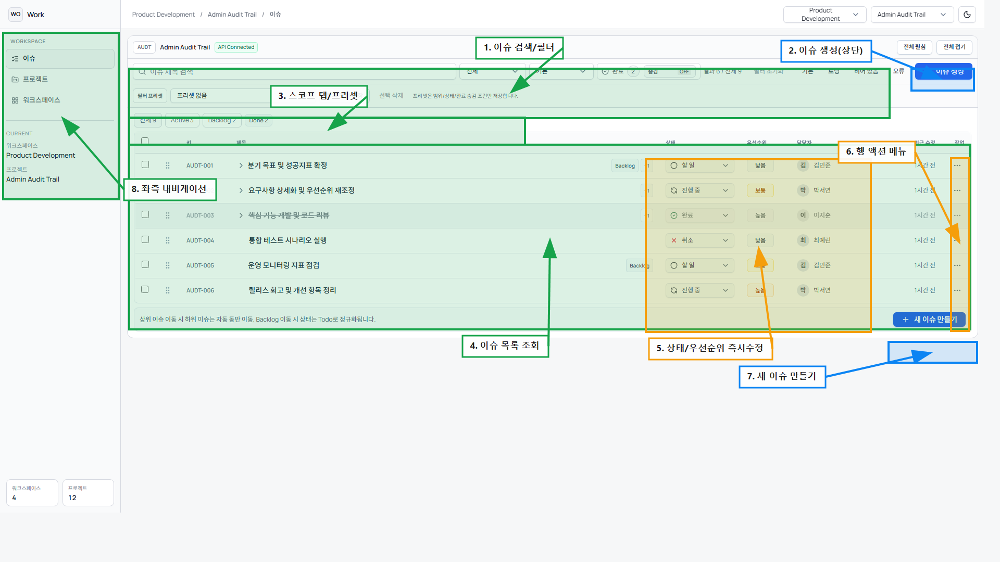

# 이슈 화면 CRUD 주석 가이드

## 1. 번호별 마킹 설명
| 번호 | 기능 | 동작 | 설명 |
|---|---|---|---|
| 1 | 이슈 검색/필터 | 조회 | 제목 검색, 상태/밀도/완료 숨김 조건으로 조회 범위를 제한합니다. |
| 2 | 이슈 생성(상단) | 생성 | 상단 `+ 이슈 생성` 버튼입니다. |
| 3 | 스코프 탭/프리셋 | 조회 | `전체/Active/Backlog/Done` 탭, 프리셋 저장/적용을 사용합니다. |
| 4 | 이슈 목록 조회 | 조회 | 이슈 목록과 기본 컬럼을 조회합니다. |
| 5 | 상태/우선순위 즉시수정 | 수정 | 목록 행에서 상태/우선순위를 즉시 수정합니다. |
| 6 | 행 액션 메뉴 | 수정 | 행 단위 부가 작업(상세 이동/보조 액션) 진입점입니다. |
| 7 | 새 이슈 만들기 | 생성 | 하단 `+ 새 이슈 만들기`로 빠르게 추가합니다. |
| 8 | 좌측 내비게이션 | 조회 | 이슈/프로젝트/워크스페이스 화면 전환 내비게이션입니다. |

## 2. 실무 CRUD 시나리오
1. 생성: `2` 또는 `7`에서 이슈를 생성합니다.
2. 조회: `1`, `3`, `4`를 사용해 필요한 이슈만 추려서 조회합니다.
3. 수정: `5`에서 상태/우선순위를 즉시 반영하고, 추가 작업은 `6`으로 진행합니다.
4. 삭제: 이슈 삭제는 목록 우측 행 액션(`6`) 또는 상세 패널에서 수행합니다.

## 3. 운영 체크 포인트
1. 필터가 켜진 상태에서는 정렬/재배치 동작이 제한될 수 있습니다.
2. 상위/하위 이슈 구조에서는 순환 참조가 금지됩니다.
3. 동일 이슈를 여러 사용자가 수정할 때는 활동 로그 기준으로 최종 반영값을 확인합니다.
