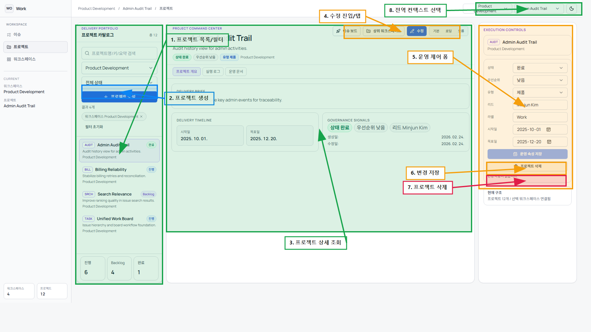

# 프로젝트 화면 CRUD 주석 가이드

## 1. 번호별 마킹 설명
| 번호 | 기능 | 동작 | 설명 |
|---|---|---|---|
| 1 | 프로젝트 목록/필터 | 조회 | 프로젝트 목록 조회, 워크스페이스/상태/검색 필터를 사용합니다. |
| 2 | 프로젝트 생성 | 생성 | 좌측 패널의 `+ 프로젝트 생성` 버튼입니다. |
| 3 | 프로젝트 상세 조회 | 조회 | 선택한 프로젝트의 개요/타임라인/신호 정보를 확인합니다. |
| 4 | 수정 진입/탭 | 수정 | `수정` 버튼과 상세 탭(개요/로그/문서) 진입 영역입니다. |
| 5 | 운영 제어 폼 | 수정 | 상태/우선순위/유형/리드/일정/라벨 필드를 편집합니다. |
| 6 | 변경 저장 | 수정 | 우측 패널의 저장 버튼입니다. |
| 7 | 프로젝트 삭제 | 삭제 | 우측 패널의 삭제 버튼입니다. |
| 8 | 전역 컨텍스트 선택 | 조회 | 상단 워크스페이스/프로젝트 컨텍스트를 전환합니다. |

## 2. 실무 CRUD 시나리오
1. 생성: `2`에서 프로젝트 기본 정보를 입력해 등록합니다.
2. 조회: `1`로 대상 프로젝트를 찾고 `3`에서 상세를 검토합니다.
3. 수정: `4`로 편집 모드 진입 후 `5` 필드를 수정하고 `6`으로 저장합니다.
4. 삭제: 사용 종료 프로젝트는 `7`로 삭제합니다. 하위 이슈가 함께 정리되는지 운영 정책을 확인합니다.

## 3. 운영 체크 포인트
1. `Key Prefix`는 대문자 2~6자 규칙을 유지합니다.
2. 시작일이 목표일보다 늦으면 저장이 거부됩니다.
3. 삭제 전, 해당 프로젝트 이슈 이관 여부를 먼저 결정합니다.
