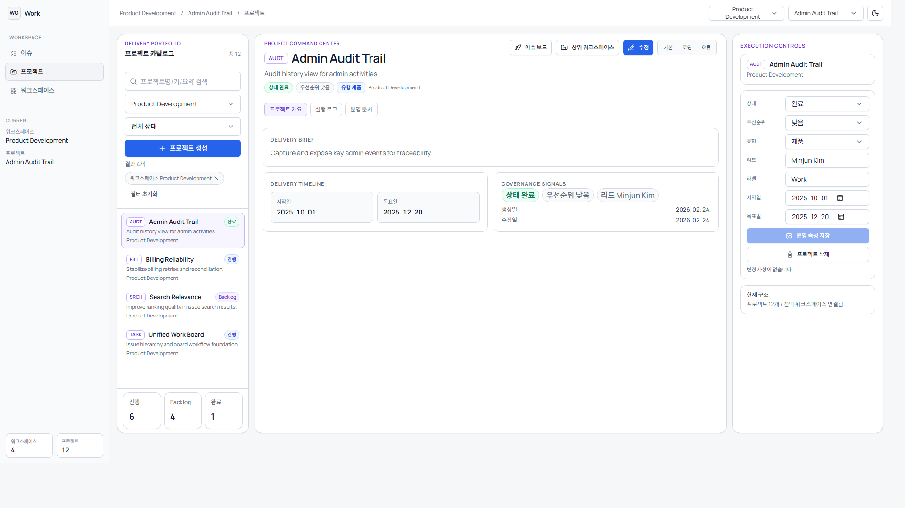
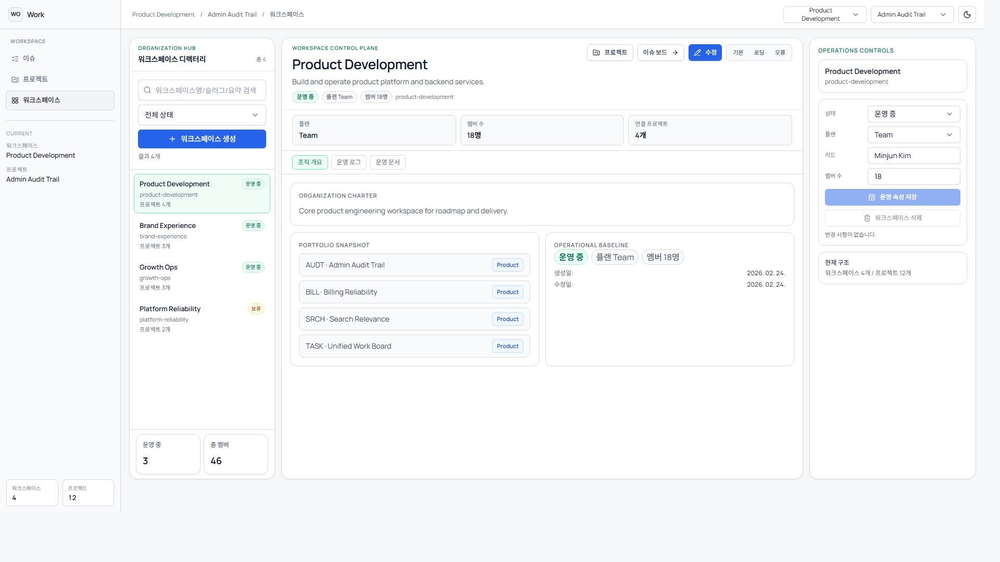

# 웹앱 상세 사용 설명서

## 1. 문서 범위
이 문서는 `todolist_vibe` 웹앱의 실제 사용 방법을 운영자/실무 사용자 관점에서 정리합니다.
설정 가능한 값, 화면별 기능, 제약 사항, 운영 시나리오를 포함합니다.

## 2. 서비스 구조
- 워크스페이스: 조직 단위 관리 영역
- 프로젝트: 워크스페이스에 속한 과제 묶음
- 이슈: 프로젝트에 속한 실행 항목
- 이슈 계층: 루트 이슈와 하위 이슈(트리)

관계:
- 워크스페이스 1:N 프로젝트
- 프로젝트 1:N 이슈
- 이슈 1:N 하위 이슈

## 3. 실행/종료/접속
프로젝트 루트: `todolist_vibe\todolist_vibe`

실행:
```powershell
.\scripts\dev.ps1 docker-up -Engine podman -ApiPort 18080
```

종료:
```powershell
.\scripts\dev.ps1 docker-down -Engine podman -ApiPort 18080
```

접속 URL:
- 웹: `http://127.0.0.1:5173`
- API: `http://localhost:18080`

컨텍스트 URL 예시:
- `http://127.0.0.1:5173/issues?workspace=90000000-0000-0000-0000-000000000001&project=cccccccc-cccc-cccc-cccc-cccccccccccc`

## 4. 전체 화면 구성
### 4.1 공통 내비게이션
- 좌측 사이드바: `이슈 / 프로젝트 / 워크스페이스` 화면 전환
- 상단 바:
- 워크스페이스 선택
- 프로젝트 선택
- 현재 경로 표시
- 테마 토글

### 4.2 컨텍스트 동기화 방식
- URL 쿼리: `workspace`, `project`
- 로컬 스토리지: 마지막 선택 컨텍스트 유지
- 프로젝트 선택이 워크스페이스와 불일치하면 워크스페이스가 자동 동기화됨

## 5. 이슈 화면 (`/issues`)


### 5.1 핵심 개념
이슈 화면은 실행 단위 작업 관리 중심입니다.
- 필터/검색/프리셋으로 작업 대상을 좁힘
- 계층 구조로 상위-하위 이슈 운영
- 상세 패널에서 상태, 우선순위, 담당자, 상위 이슈를 즉시 편집

### 5.2 상단 툴바 기능
- 제목 검색
- 상태 필터
- 테이블 밀도 변경
- 완료 이슈 숨김 토글
- 필터 프리셋 저장/적용/삭제
- 이슈 생성

상태 필터 값:
- `All`
- `Todo`
- `InProgress`
- `Done`
- `Cancel`

테이블 밀도 값:
- `compact`
- `default`
- `comfortable`

### 5.3 스코프 탭
- `전체`: 모든 이슈
- `Active`: 진행 대상 중심 뷰
- `Backlog`: 대기/아이디어 중심 뷰

### 5.4 다중 선택 일괄 작업
여러 이슈 선택 후 아래 항목을 일괄 변경 가능:
- 상태
- 우선순위
- 담당자

### 5.5 상세 패널(좌측) 편집 항목
- 제목
- 설명(마크다운 작성/미리보기)
- 상태
- 우선순위
- 담당자
- 상위 이슈
- 하위 이슈 관리

설명 편집 도구:
- H2
- 강조
- 기울임
- 목록
- 코드
- 링크

### 5.6 상세 패널(우측) 정보/활동
Overview:
- 이슈 키
- 상태
- 우선순위
- 담당자
- 프로젝트명
- 상위 이슈
- 생성/수정 시각

Activity:
- 변경 로그 + 댓글 통합 타임라인
- 필터: `all`, `changes`, `comments`
- 댓글 작성: Enter 등록, Shift+Enter 줄바꿈

### 5.7 이슈 계층 제약
- 자기 자신을 상위 이슈로 지정할 수 없음
- 자신의 하위 이슈를 상위로 지정할 수 없음(사이클 방지)
- 상위 이슈는 반드시 동일 프로젝트 내 이슈여야 함

### 5.8 드래그 정렬 제약
- 같은 부모 레벨(형제)끼리만 reorder 가능
- 검색/필터/숨김 조건이 활성화되면 reorder 제한
- reorder 후 `order`가 서버 기준으로 재정렬됨

### 5.9 이슈 생성/수정 실무 팁
- 상위 이슈는 먼저 목표/결과 중심으로 생성
- 하위 이슈는 실행 단위(담당 가능 단위)로 쪼개기
- `Done` 처리 전에 설명/코멘트로 변경 배경 남기기

## 6. 프로젝트 화면 (`/projects`)


### 6.1 핵심 개념
프로젝트 카탈로그는 실행 단위 그룹을 관리합니다.
- 프로젝트 상태/우선순위/일정을 운영
- 워크스페이스별 포트폴리오 구조를 정리

### 6.2 검색/필터
검색 대상:
- 프로젝트명
- Key Prefix
- 요약

필터:
- 워크스페이스
- 상태

### 6.3 생성/수정 가능 필드
- 이름
- 워크스페이스
- 타입
- Key Prefix
- 상태
- 우선순위
- 리드
- 요약
- 설명
- 시작일
- 목표일
- 라벨

값 범위:
- 타입: `Product | Design | Marketing`
- 상태: `Backlog | Active | Paused | Completed`
- 우선순위: `None | Low | Medium | High`
- Key Prefix: 대문자 영문 2~6자

### 6.4 운영 동작
- 프로젝트 삭제 시 해당 프로젝트의 이슈가 함께 삭제됨
- 존재하지 않는 워크스페이스로 이동/생성 불가
- 이슈 키는 프로젝트 Key Prefix 기반으로 자동 생성

## 7. 워크스페이스 화면 (`/workspaces`)


### 7.1 핵심 개념
워크스페이스 카탈로그는 조직 단위 운영 정보 관리 화면입니다.
- 조직 상태
- 인원 규모
- 리드
- 설명/요약

### 7.2 검색/필터
검색 대상:
- 이름
- slug
- 요약

필터:
- 상태

### 7.3 생성/수정 가능 필드
- 이름
- 플랜
- 상태
- 멤버 수
- 리드
- 요약
- 설명

값 범위:
- 플랜: `Starter | Team | Scale`
- 상태: `Active | Paused | Archived`
- 멤버 수: `1 ~ 100000`

### 7.4 삭제 제약
- 하위 프로젝트가 존재하면 삭제 불가(409 Conflict)

## 8. 필드 규칙 요약
### 8.1 워크스페이스
- 이름: 최대 120자
- 리드: 최대 120자
- 요약: 최대 400자
- 설명: 최대 4000자

### 8.2 프로젝트
- 이름: 최대 120자
- Key Prefix: `^[A-Z]{2,6}$`
- 리드: 최대 120자
- 요약: 최대 400자
- 설명: 최대 4000자
- 라벨: 최대 60자
- 시작일 > 목표일 불가

### 8.3 이슈
- 제목: 최대 160자
- 설명: 최대 4000자
- 담당자 ID: 최대 120자
- 상태: `Todo | InProgress | Done | Cancel`
- 우선순위: `Low | Medium | High`

## 9. 데이터 모드
### 9.1 API 모드
- 조건: `VITE_API_BASE_URL` 설정
- 동작: 백엔드 API + 실제 DB 데이터 사용

### 9.2 Mock 모드
- 조건: API 비활성
- 동작: 프론트 mock 데이터 사용

## 10. 실무 운영 시나리오
### 10.1 신규 워크스페이스 온보딩
1. 워크스페이스 생성
2. 프로젝트 1~3개 생성
3. 기본 상태는 `Backlog`로 시작
4. 이슈를 상위/하위로 분해

### 10.2 스프린트 운영
1. Backlog에서 Active로 전환할 이슈 선별
2. 우선순위/담당자 일괄 반영
3. 활동 로그와 댓글로 의사결정 근거 기록
4. 완료 시 `Done` 처리 후 회고 항목을 코멘트로 기록

### 10.3 구조 재정비
1. 프로젝트를 워크스페이스 필터로 점검
2. 중복/정리 대상 프로젝트 비활성 또는 완료 처리
3. 이슈 계층 재정렬(같은 부모 내 reorder)

## 11. 화면 캡처
- 홈: 
- 이슈: 
- 프로젝트: 
- 워크스페이스: 

## 12. 운영 점검 명령
```powershell
.\scripts\dev.ps1 api-health -ApiPort 18080
.\scripts\dev.ps1 smoke -ApiPort 18080
```

## 13. CRUD 주석 문서(기능별)
- 인덱스: [CRUD_ANNOTATION_INDEX.md](./CRUD_ANNOTATION_INDEX.md)
- 홈 온보딩: [HOME_ONBOARDING_ANNOTATED_GUIDE.md](./HOME_ONBOARDING_ANNOTATED_GUIDE.md)
- 이슈: [ISSUES_CRUD_ANNOTATED_GUIDE.md](./ISSUES_CRUD_ANNOTATED_GUIDE.md)
- 프로젝트: [PROJECTS_CRUD_ANNOTATED_GUIDE.md](./PROJECTS_CRUD_ANNOTATED_GUIDE.md)
- 워크스페이스: [WORKSPACES_CRUD_ANNOTATED_GUIDE.md](./WORKSPACES_CRUD_ANNOTATED_GUIDE.md)
