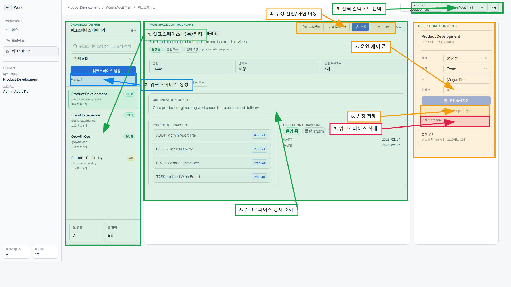

# 워크스페이스 화면 CRUD 주석 가이드

## 1. 번호별 마킹 설명
| 번호 | 기능 | 동작 | 설명 |
|---|---|---|---|
| 1 | 워크스페이스 목록/필터 | 조회 | 워크스페이스 목록 조회, 상태/검색 조건을 적용합니다. |
| 2 | 워크스페이스 생성 | 생성 | 좌측 패널의 `+ 워크스페이스 생성` 버튼입니다. |
| 3 | 워크스페이스 상세 조회 | 조회 | 조직 개요, 연결 프로젝트, 운영 지표를 확인합니다. |
| 4 | 수정 진입/화면 이동 | 수정 | `수정` 버튼과 상단 이동(프로젝트/이슈 보드) 영역입니다. |
| 5 | 운영 제어 폼 | 수정 | 상태/플랜/리드/멤버 수 등 운영 필드를 수정합니다. |
| 6 | 변경 저장 | 수정 | 우측 패널 저장 버튼입니다. |
| 7 | 워크스페이스 삭제 | 삭제 | 우측 패널 삭제 버튼입니다. |
| 8 | 전역 컨텍스트 선택 | 조회 | 전역 컨텍스트(워크스페이스/프로젝트)를 전환합니다. |

## 2. 실무 CRUD 시나리오
1. 생성: `2`에서 워크스페이스를 생성합니다.
2. 조회: `1`에서 조직을 검색하고 `3`에서 연결 프로젝트 상태를 검토합니다.
3. 수정: `4`로 편집 진입 후 `5` 필드를 수정하고 `6`으로 저장합니다.
4. 삭제: 종료 조직은 `7`로 삭제합니다. 하위 프로젝트 존재 시 삭제가 제한됩니다.

## 3. 운영 체크 포인트
1. 멤버 수는 허용 범위(1~100000)를 유지해야 합니다.
2. 삭제 실패(409) 시 먼저 하위 프로젝트를 정리해야 합니다.
3. 컨텍스트 전환(`8`) 후 현재 화면 데이터가 바뀌는지 반드시 확인합니다.
